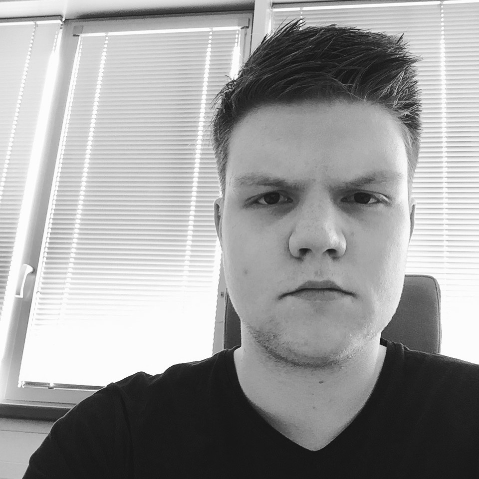

{:width="320" class="profile-picture"}

# Marián Hlaváč

  - 21 let
  - Praha, Česká republika
  - Vývojář webových a mobilních aplikací a aplikací pro systémy virtuální reality
 
  - Pocházím z Moravskoslezska
  - Mluvím česky a anglicky, rozumím polsky, slovensky a rusky
 
## Jak mě kontaktovat a sociální sítě

  - [letters@majko.cz](mailto:letters@majko.cz)
  - [+420 605 347 542](tel:+420605347542)
  - [cz.linkedin.com/in/majko](http://cz.linkedin.com/in/majko){:target="_blank"}
  - [fb.com/marian.hlavac](http://fb.com/marian.hlavac){:target="_blank"}
  - [twitter.com/mmajko](http://twitter.com/mmajko){:target="_blank"}
  
  
  - [github.com/mmajko](http://github.com/mmajko){:target="_blank"}
  - [youtube.com/majko15](http://youtube.com/majko15){:target="_blank"}
  - [majko15.deviantart.com](http://majko15.deviantart.com){:target="_blank"}
  - [medium.com/@mmajko](https://medium.com/@mmajko){:target="_blank"}
   
## Co jsem se učil a co se učím

  - Dokončil jsem [Střední školu průmyslovou v Karviné](http://sps-karvina.cz){:target="_blank"}, obor Informační technologie.
  - Studuji bakaláře na [Fakultě informačních technologií](http://fit.cvut.cz){:target="_blank"}, [Českého vysokého učení technického v Praze](http://cvut.cz){:target="_blank"}.
  
## Co umím a dělám

  - Vývoj webových aplikací
    - Kódování webových šablon
      - HTML5, CSS3, v souladu s moderními technologiemi, základy SEO a přístupnosti
    - Javascriptové aplikace
      - Moderní server-side Node.js aplikace, ale i client-side a Universal JS - React, Vue.js, ES6, Babel
    - Ostatní backend
      - Ruby on Rails, PHP s frameworky Nette, Laravel a Symfony
  - Vývoj v dalších programovacích a skriptovacích jazycích
    - C, C++, C#, Python, Ruby, Bash
  - Práce s verzovacími systémy
    - GIT SCM, SVN
  - Grafický design
    - Návrh UI, UX consulting, print design
    - Vektorová a rastrová grafika
    - Adobe Photoshop, Adobe Illustrator, Affinity Designer, Affinity Photo, Inkscape
    - reference na [mém deviantart profilu](http://majko15.deviantart.com){:target="_blank"}
  - Herní vývoj
    - Zkušenosti s populárními herními enginy (Unity, UnrealEngine, Defold)
    - Základy game theory a designu
    - Moderní OpenGL a WebGL
    - Specializuji se na vývoj her (i aplikací) pro systémy virtuální reality
    - Platformy HTC Vive, Oculus Rift a Google Cardboard
  - Střih videí a fotografie
    - Základy filmařiny a editace pořízených záběrů, jejich střih a postprodukce
    - Adobe Premiere, Sony Vegas Pro, HitFilm, iMovie
    - Základy fotografie a postprodukce
    - Adobe Lightroom, Adobe Photoshop
    - reference na [mém youtube profilu](http://youtube.com/majko15){:target="_blank"}
  - 3D modelování
    - Amatérské základy modelování, UV mappingu a texturování a optimalizace pro rendering
    - Blender, OpenSCAD
    - Úprava meshů pro 3D tisk, znalosti technologií 3D tisku
  - Tvorba hudby
    - Amatérský koníček, žánr elektronická hudba
    - FL Studio, GarageBand
    - reference na [mém soundcloud profilu](https://soundcloud.com/mmajko){:target="_blank"}
  - Hardware
    - Amatérský koníček
    - Arduino, Raspberry Pi
    - Slaboproud, elektronika
    
## Kde jsem pracoval

  - Vývojář v ICT oddělení na Fakultě informačních technologií ČVUT *2015 -- &hellip;*
    - Na ICT oddělení Fakulty informačních technologií univerzity ČVUT v Praze pracuji jako front-endový vývojář.
    - [fit.cvut.cz](http://fit.cvut.cz){:target="_blank"}
  - Kodér a vývojář webových aplikací ve společnosti BRANDNEW *2013 -- 2015*
    - V mladé reklamní agentuře Brand New s.r.o. jsem se podílel na tvorbě či úpravách webových prezentací některých projektů jejich klientů. V drtivé většině případů jsem měl na starosti kódování. Společně s velmi schopným a společenským kolektivem z Brand New s.r.o. jsem rád tvořil poutavé kampaně a projekty pro významné klienty, jako Nestlé či Beko.
    - HTML5, CSS3, SASS, PHP
    - [brandnew.cz](http://brandnew.cz){:target="_blank"}
  - Kodér a vývojář webových aplikací pro Fiolasoft Studio *2013 -- 2015*
    - Ve studiu FiolaSoft jsem se podílel na vývoji nového webového portálu herního pořadu Indian a zakázkách pro klienta Playman s.r.o.
    - Tvorba portálu herního pořadu Indian
    - Tvorba e-shopu Playclub pro klienta Playman s.r.o.
    - [fiolasoft.cz](http://fiolasoft.cz){:target="_blank"}
  - Kodér a vývojář webových aplikací v týmu Venetico *2011 -- 2013*
    - V týmu Venetico jsem zastával funkci HTML kodéra a PHP programátora webových aplikací.
    - Webové prezentace pro organizace a společnosti, CMS na míru, B2B správa produktů.
    
## Jaké projekty jsem dělal a dělám

  - Thesisman *2017 -- &hellip;*
    - *WIP*
  - Student Game Developers *2017 -- &hellip;*
    - *WIP*
  - Immersion VR *2017*
    - *WIP*
  - Osudové hry *2015 -- 2017*
    - Společenská soutěž o sud piva, cílená na (nejen) vysokoškolské studenty a komunitu studentů univerzity ČVUT. V rámci projektu bylo možné získat zkušenosti s organizací jednodenních událostí, či víkendových výletů.
    - [osudovehry.cz]()
  - Indian Play *2012 -- 2014*
    - Komunitní doplnění herního pořadu Indian - živá vysílání, rychlé recenze a bližší spojení komunity s redakcí herního pořadu Indian a redakcí projektu Indian Play přineslo spoustu hodin zábavy jak našim divákům tak i nám autorům samotným.
    - V redakci pořadu Indian jsem byl zaúkolován právě jako leader týmu Indian Play a zprostředkovával komunikaci s redakcí. Pod záštitou Fiolasoft studia jsme měli možnosti, jak představit divákům i ty hry, které ještě nespatřily světlo světa. S celkovým počtem 7 milionů zhlédnutí a téměř 80 tisíc odběratelů na YouTube kanálu herního pořadu, se Indian ve své době řadil mezi nejsledovanější herní pořady v ČR.
  - Kybernauts *2011 -- 2013*
    - Projekt Kybernauts bylo týmové uskupení producentů komentovaných herních internetových videí určených pro mladé diváky se zájmem o počítačové hry. Za krátké dvouleté působení na platformě YouTube a Twitch.tv jsme si získali desetitisíce fanoušků a naše videa byly shlédnuty více než milionkrát.
    - V týmu Kybernauts jsem zastával roli spoluzakladatele a následně team leadera, získal jsem cenné zkušenosti s tvorbou multimédií a managementem týmu.